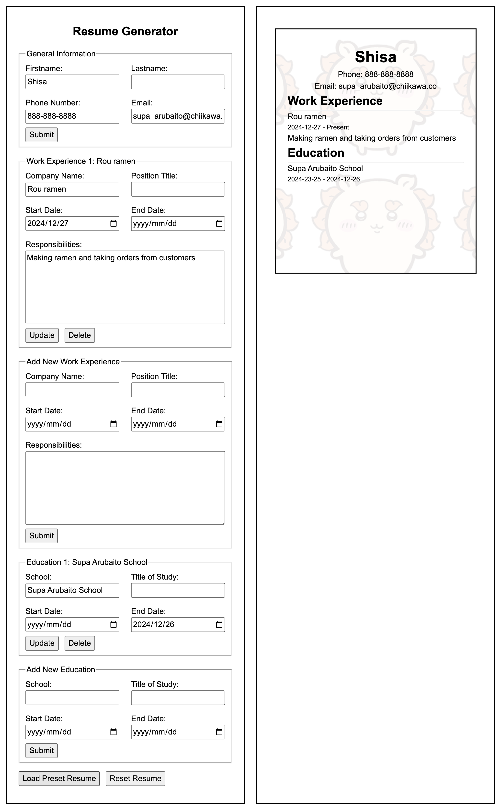

<h1 align="center">Resume Generator</h1>
<h3 align="center">Create your own resume using Resume Generator!</h3>
<h3 align="center"><a href=''>Click to see live</a></h3>

### Project for The Odin Project: [Lesson link](https://www.theodinproject.com/lessons/node-path-react-new-cv-application)

### Features
- Generating a resume from user input
- Loading a preset resume
- Reseting resume data
- Add multiple work experiences / educations
- Update and delete work experiences / educations
- Two stunning view modes!
    - Mobile / Tablet
    - Desktop

### Stack
- React 
- JSX
- CSS
- HTML
- Git / GitHub

## Learning Outcomes
- First time using React and writing jsx for a project!
- Try to do it right the first time or you will eventually rewrite the code
    - Initially, I populated the resume info by querySelecting the element and modifying textContent
    - This isn't how I wanted to use React 
    - I ended up rewriting the component to populate data from state data instead

## Retrospective (aka yapping)
Good lesson learned to do it right the first time. React is convenient because HTML and JS are in the same space. I can modify both together without variables / classnames / data getting lost between the files. I didn't polish this project as much as the other ones. I will come back to this one and add some more polish later (maybe!)

## Potential Improvements
1. Make some input data required 
2. Show / Hide button for add new work experience / education
3. Add some more styling for the resume

## Acknowledgements
| Usage   | Source         |
| ------- | -------------- |
| Artwork | Ogino |
